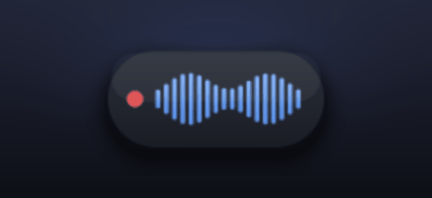
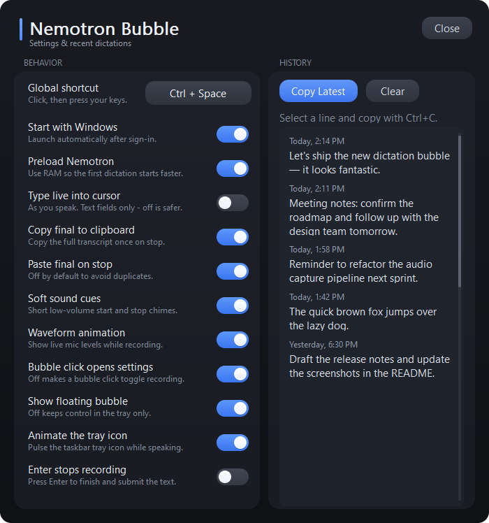

<div align="center">

# Nemotron Bubble

**A tiny, beautiful push-to-talk dictation bubble for Windows.**

> macOS support is available on the `macos-support` branch under `macos/`.
> The Mac app is a native menu-bar app with a bundled Rust Nemotron engine.

Press your shortcut, speak, and your words appear at the cursor — powered by
**on-device** NVIDIA Nemotron speech recognition.




</div>

---

## Features

- **Push-to-talk** — one shortcut starts and stops dictation from any app.
- **Customizable shortcut** — click *Global shortcut* in settings and press any combo (Ctrl / Alt / Shift + key). Defaults to `Ctrl+Space`.
- **Safe insertion by default** — on stop the transcript is pasted once (clipboard + a single Ctrl+V), so it never trips app shortcuts. *Type live into cursor* is an opt-in for real text editors.
- **Auto-stops on silence** — forgets nothing but won't run forever; stops after 15 s of quiet.
- **Private and offline** — runs the Nemotron ONNX model locally. No internet, no accounts, no telemetry.
- **Live waveform bubble** — a smooth, anti-aliased floating mic meter you can drag anywhere.
- **Tray mode** — hide the bubble and watch the waveform pulse right in the taskbar tray instead.
- **Recent dictations** — scrollable history with one-click *Copy Latest*.
- **One clean clipboard copy on stop** — with optional auto-paste.
- **Starts with Windows**, soft sound cues, model preloading — all toggleable.

## Settings



## Requirements

- **Windows 10 or 11** (64-bit).
- A **microphone**.
- **~2.4 GB free disk** for the speech model (downloaded once).
- **~3 GB of free RAM** while dictating — the model runs entirely in memory.
- To build from source: the [Rust toolchain](https://rustup.rs) (MSVC).

> **Memory note:** the Nemotron model is ~0.6B parameters and uses roughly **2.5–3 GB of RAM** while loaded. With *Preload Nemotron* enabled (default) that memory is held so the first dictation is instant. Turn it off to keep RAM free when idle — the model then loads on first use instead.

## Quick start

```powershell
git clone https://github.com/snipemanmike/nemotron-bubble.git
cd nemotron-bubble

# One-time: download the Nemotron speech model (~2.4 GB) into models\nemotron\
.\scripts\download-nemotron.ps1

# Build and run
cargo run --release
```

Prefer the multilingual model? Run `.\scripts\download-nemotron.ps1 -Multilingual`.
You can also point at a custom folder with `$env:NEMOTRON_MODEL_DIR = "C:\path\to\nemotron"`.

Or grab a prebuilt binary from the [Releases](https://github.com/snipemanmike/nemotron-bubble/releases) page and run the download script next to it.

## Controls

| Action | How |
| --- | --- |
| Start / stop dictation | your shortcut (default `Ctrl+Space`) |
| Change the shortcut | open settings, click *Global shortcut*, press the new combo |
| Open / close settings | click the bubble **or** the tray icon |
| Move the bubble | drag it |
| Tray menu (start, show/hide, quit) | right-click the tray icon |

## How it works

Nemotron Bubble is a single-file Rust app built directly on the Win32 API — no Electron, no web view, ~5 MB binary. Microphone audio is captured with [`cpal`](https://crates.io/crates/cpal), streamed through the [`parakeet-rs`](https://crates.io/crates/parakeet-rs) Nemotron ONNX model, and injected into the focused window as Unicode keystrokes. The floating bubble is a **per-pixel-alpha layered window** drawn by a small software canvas with signed-distance anti-aliasing, so the pill, shadow, and waveform stay crisp and smooth.

## Build

```powershell
cargo build --release            # the app

# Regenerate the README art (bubble.png, demo.gif, settings.png)
cargo run --release --features assets -- --render-assets docs
```

## Credits

- Speech recognition via [parakeet-rs](https://crates.io/crates/parakeet-rs) and NVIDIA's Nemotron streaming ASR.
- Model weights hosted on Hugging Face.

## License

MIT — see [LICENSE](LICENSE).
